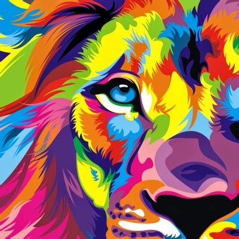

# Neural-Style-Transfer

Neural style transfer is an optimization technique used to take two image and blend them together so the output image looks like the content image, but "painted" in the style of the reference image.

let's look at an example:

We consider the following image as our content image ("Nivin Pauly  an Indian actor and producer. Known for his work in Malayalam cinema")

And the following is our style Image:

Using the Neural Style Transfer as explained in the paper we can get a generated image as the following Image:

As you can see it has taken the "content" from the content image and applied a "style" to it to generate a new image

If you have a look in the code due to computing restrictions I reduced the image size of the generated image to 356, you can change the same if you have good computational resourses(just change the value of `img_size` variable in the code)

If you want more information I highly recommend you to read the paper 
[A Neural Algorithm of Artistic Style](https://arxiv.org/abs/1508.06576)

Also following [video](https://www.youtube.com/watch?v=imX4kSKDY7s&t=1031s) also helped me alot 
